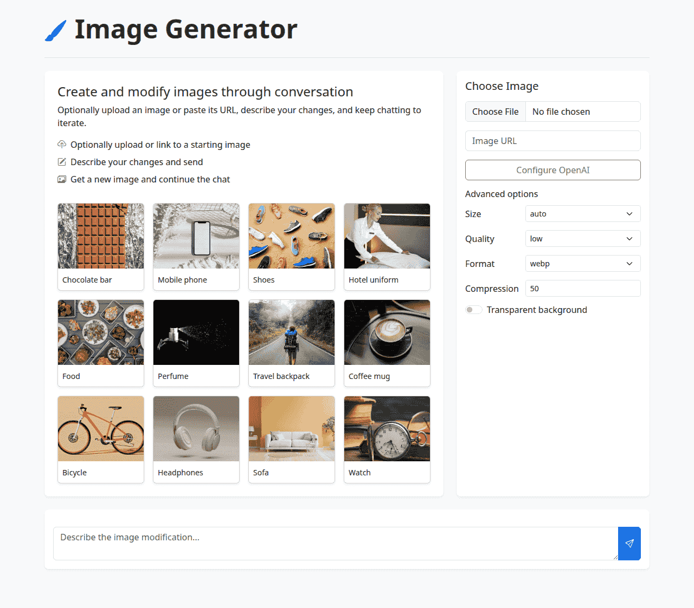

# Image Generator

Interactively generate and modify images using OpenAI's `gpt-image-1-mini` model. Optionally upload an image or paste a URL, describe the changes you want, and chat to refine the result. A few sample images are loaded from `config.json` to try out the tool quickly.

## What it does

1. **Image Selection**
   - Optionally upload an image or paste its URL.
   - A set of sample images are provided as quick starting points.
2. **Prompt-Based Editing**
   - Describe how you want the image updated. If no image is chosen, a brand new one is generated.
3. **Iterative Chat**
   - Each generated image becomes the new base so you can keep refining it in subsequent prompts.

## How it works

1. Configure your OpenAI key and select an allowed base URL from LLM Foundry.
2. Optionally upload an image or paste a URL and type a prompt describing your desired output.
3. If an image is provided, it is sent to the `/images/edits` endpoint. Otherwise `/images/generations` is used.
4. The returned `b64_json` is displayed and becomes the new base image.
5. Continue chatting with new prompts to iteratively improve the image.

Sample images and prompts are read from `config.json` on page load.
